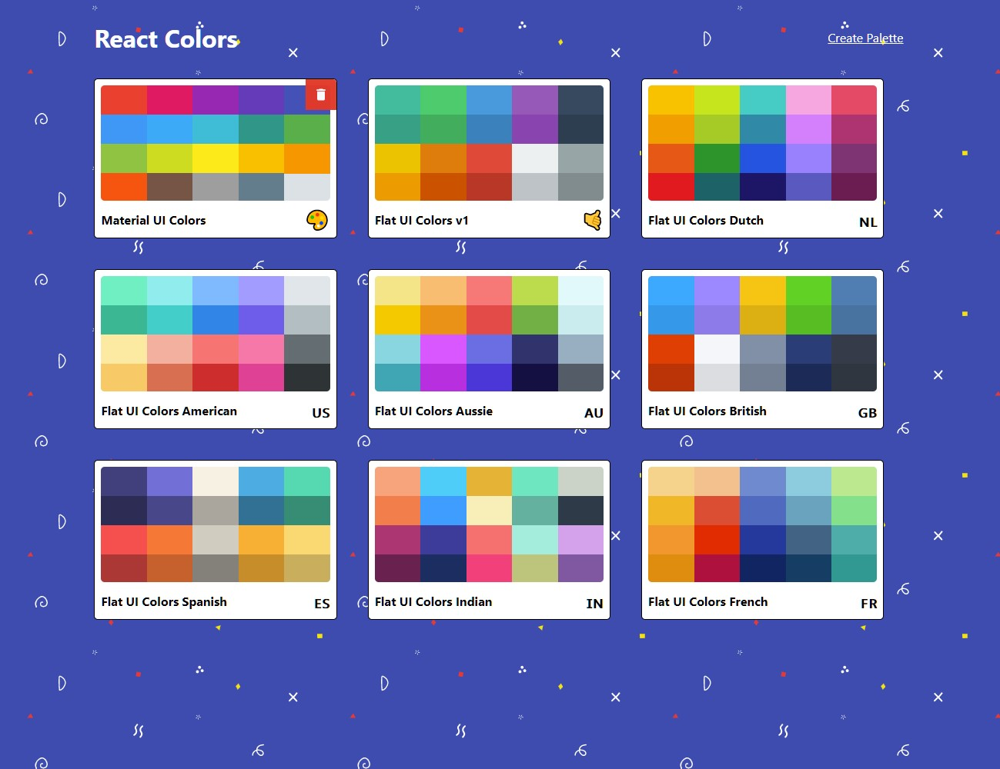
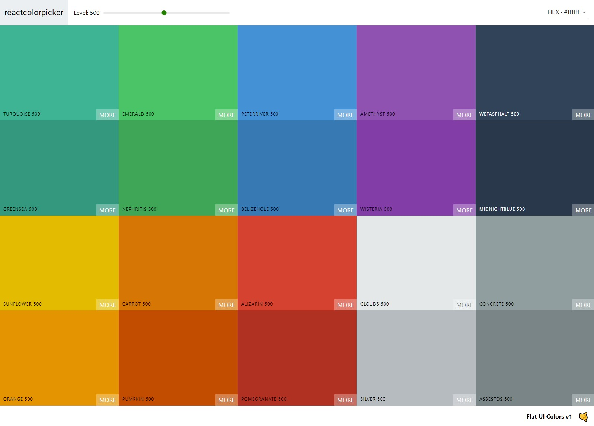

# React Color Picker

A [React](https://reactjs.org/) app lets users select a color palette or build their own palette.

The project was created for [The Modern React Bootcamp](https://www.udemy.com/course/modern-react-bootcamp/) by [Colt Steele](https://github.com/Colt).





## 📂 Local Installation

In the project directory:

1. Install dependencies
    ```sh
    npm install
    ```

2. Start the development server (Open [http://localhost:3000](http://localhost:3000) to view it in the browser).
    ```sh
    npm start
    ```
## :hammer_and_wrench: Technologies Used
The following tools were used to develop this project:
* [React](https://reactjs.org/)
* [Material-UI](https://material-ui.com/)